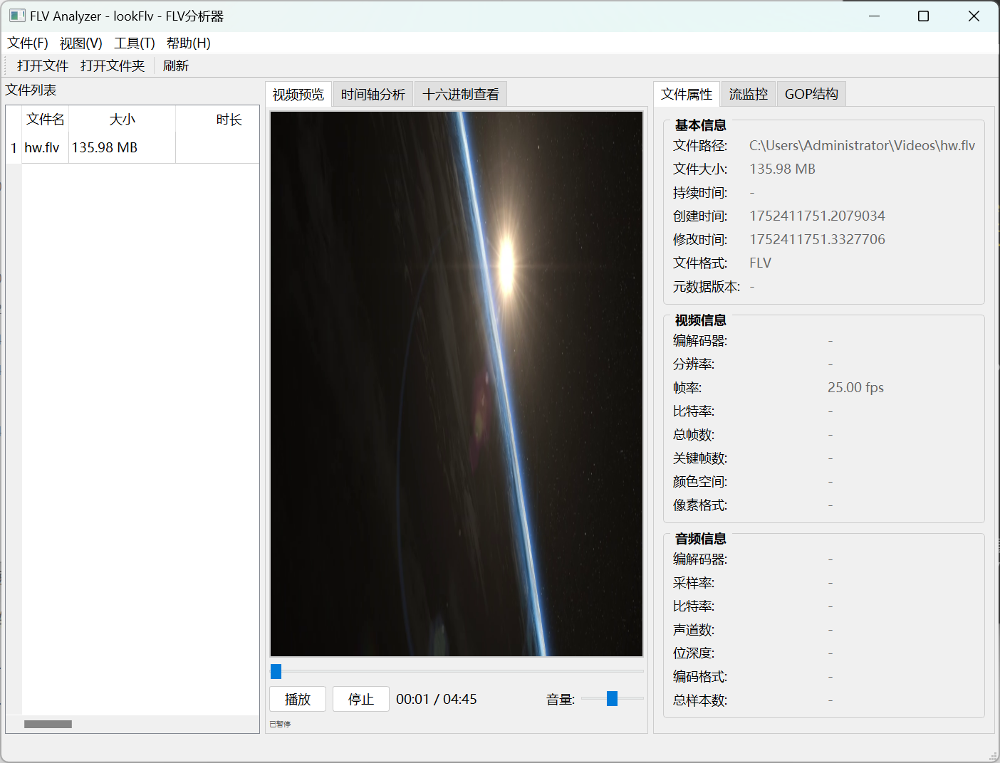
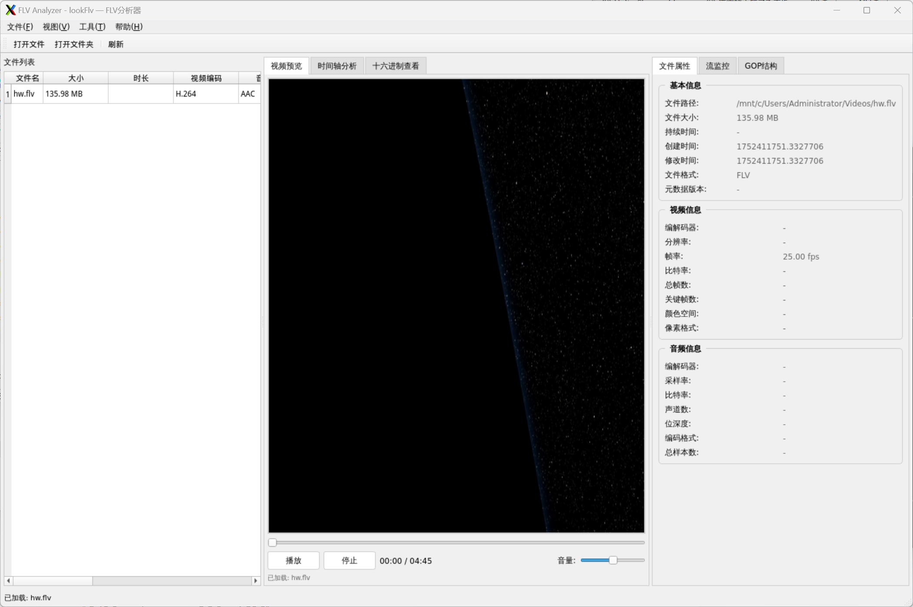

# lookFlv

<div align="center">
  
  
</div>

一个功能强大的FLV文件分析工具，支持完整的FLV文件解析、播放和分析。


## ✨ 特性

- 🎬 **完整FLV播放** - 内置视频播放器，支持FLV文件播放
- 🔍 **深度解析** - 完整的FLV文件结构分析，包括头部、标签、元数据
- 📊 **可视化分析** - GOP结构图、时间轴图表、音画同步分析
- 🔧 **十六进制查看器** - 二进制数据可视化，支持标签高亮
- 📈 **实时监控** - 流数据实时监控和仪表盘
- 🧩 **插件系统** - 支持AVS3、VVC等新格式扩展
- 🎯 **双模式操作** - GUI图形界面和CLI命令行双模式
- 🌐 **跨平台支持** - Windows、Linux、WSL环境适配

## 🚀 快速开始

### 环境要求

- Python 3.7+
- PyQt5 5.15.9+
- 推荐在Windows环境使用以获得最佳体验

### 安装依赖

```bash
pip install -r requirements.txt
```

### 启动程序

**GUI模式（推荐）**
```bash
python main.py
```

**CLI模式**
```bash
# 查看文件信息
python main.py --cli info video.flv

# 分析文件
python main.py --cli analyze video.flv --detailed

# 验证文件
python main.py --cli validate video.flv --detailed
```

## 📖 功能介绍

### 主要功能模块

#### 🎬 视频播放器
- 支持FLV文件直接播放
- 播放控制（播放/暂停/停止）
- 进度条跳转和音量调节
- 基于moviepy引擎，播放质量优异

#### 🔍 文件分析
- **FLV结构解析** - 解析FLV头部和标签结构
- **元数据提取** - 提取视频/音频元数据信息
- **时间戳分析** - 音画同步检测和时间轴可视化
- **GOP分析** - 关键帧结构和I/P/B帧分布

#### 📊 可视化工具
- **时间轴图表** - 数据流时序分析
- **GOP结构图** - 视频帧类型和结构可视化
- **十六进制查看器** - 二进制数据查看，支持标签定位
- **实时监控** - 流数据实时监控仪表盘

#### 🔧 高级功能
- **格式转换** - 基于moviepy的格式转换服务
- **报告生成** - 详细的分析报告导出
- **AI分析** - 可选的AI智能分析模块
- **插件扩展** - 支持AVS3、VVC等新标准

## 🛠️ 项目架构

```
lookFlv/
├── core/                      # 核心解析引擎
│   ├── parser/                # 二进制解析层
│   │   ├── flv_header.py      # FLV头结构解析
│   │   ├── tag_parser.py      # Tag解析器
│   │   ├── es_processor.py    # ES流处理器
│   │   └── rtmp_sniffer.py    # RTMP抓包工具
│   ├── analysis/              # 分析逻辑层
│   │   ├── metadata_extractor.py  # 元数据提取
│   │   ├── sync_analyzer.py   # 音画同步分析
│   │   ├── gop_visualizer.py  # GOP结构生成
│   │   └── error_detector.py  # 错误检测引擎
│   └── utils/                 # 核心工具
│       ├── binary_utils.py    # 二进制操作辅助
│       ├── timestamp_conv.py  # 时间戳转换
│       └── logging_system.py  # 日志处理
├── gui/                       # 图形界面
│   ├── main_window.py         # 主窗口
│   ├── widgets/               # 自定义组件
│   ├── resources/             # 界面资源
│   └── dialogs/               # 对话框
├── services/                  # 高级服务模块
│   ├── conversion_service.py  # 格式转换
│   ├── report_generator.py    # 报告生成
│   └── ai_analyser.py         # AI分析模块
├── plugins/                   # 插件系统
├── tests/                     # 测试套件
└── docs/                      # 文档
```

## 📋 依赖库

### 核心依赖
- **PyQt5** 5.15.9 - 图形界面框架
- **moviepy** 1.0.3 - 视频处理和播放
- **construct** 2.10.68 - 二进制数据结构解析
- **flvlib** 0.1.6 - FLV文件格式支持
- **pyqtgraph** 0.13.3 - 数据可视化图表

### 可选依赖
- **tensorflow** 2.19.0 - AI分析功能（可选）

## 🔧 安装指南

### Windows环境

1. **安装Python 3.7+**
   ```bash
   # 从官网下载并安装Python
   # 确保勾选"Add Python to PATH"
   ```

2. **安装依赖**
   ```bash
   pip install -r requirements.txt
   ```

3. **启动程序**
   ```bash
   python main.py
   ```

### Linux/WSL环境

1. **安装系统依赖**
   ```bash
   # Ubuntu/Debian
   sudo apt update
   sudo apt install python3 python3-pip python3-pyqt5
   
   # CentOS/RHEL
   sudo yum install python3 python3-pip python3-qt5
   ```

2. **安装Python依赖**
   ```bash
   pip3 install -r requirements.txt
   ```

3. **配置显示（WSL用户）**
   ```bash
   # 安装X11服务器（如VcXsrv）
   export DISPLAY=:0
   ```

## 🎯 使用教程

### GUI模式操作

1. **文件操作**
   - 打开FLV文件：`Ctrl+O` 或点击"打开文件"按钮
   - 支持拖拽文件到窗口

2. **视频播放**
   - 播放/暂停：空格键或播放按钮
   - 进度跳转：拖拽进度条
   - 音量控制：音量滑块

3. **分析功能**
   - 查看文件信息：右侧属性面板
   - 时间轴分析：切换到"时间轴"标签
   - 十六进制查看：切换到"十六进制"标签
   - GOP结构：切换到"GOP结构"标签

### CLI模式命令

```bash
# 查看文件基本信息
python main.py --cli info video.flv

# 详细分析文件
python main.py --cli analyze video.flv --detailed

# 验证文件完整性
python main.py --cli validate video.flv

# 查看帮助
python main.py --cli --help
```

## 🐛 故障排除

### 常见问题

**Q: GUI无法启动，提示显示错误**
```
A: WSL环境下需要配置X11转发
   1. 安装X11服务器（VcXsrv/Xming）
   2. 设置DISPLAY环境变量
   3. 或使用CLI模式：python main.py --cli
```

**Q: 播放视频时出现错误**
```
A: 检查moviepy依赖是否正确安装
   pip install moviepy==1.0.3
```

**Q: 中文字符显示异常**
```
A: 程序已自动处理中文字体，如仍有问题：
   1. 确保系统有中文字体
   2. 检查系统编码设置为UTF-8
```

### 日志查看

程序运行日志保存在 `logs/lookflv_YYYYMMDD.log`，包含详细的错误信息和调试信息。

## 🎨 界面截图

<details>
<summary>点击查看更多截图</summary>

### Windows界面


### Linux界面  


</details>

## 🚧 开发计划

- [ ] 支持更多视频格式（MP4、AVI等）
- [ ] WebRTC实时流分析
- [ ] 更多AI分析功能
- [ ] 云端协作和分享
- [ ] 插件市场

## 🤝 贡献指南

欢迎提交Issue和Pull Request！

1. Fork本项目
2. 创建feature分支 (`git checkout -b feature/AmazingFeature`)
3. 提交更改 (`git commit -m 'Add some AmazingFeature'`)
4. 推送到分支 (`git push origin feature/AmazingFeature`)
5. 创建Pull Request

## 📄 许可证

本项目采用 [MIT License](LICENSE) 许可证。

## 📞 联系方式

如有问题或建议，请通过以下方式联系：

- 提交 [Issue](https://github.com/username/lookFlv/issues)
- 发送邮件到：developer@example.com

---

⭐ 如果这个项目对你有帮助，请给我们一个Star！
